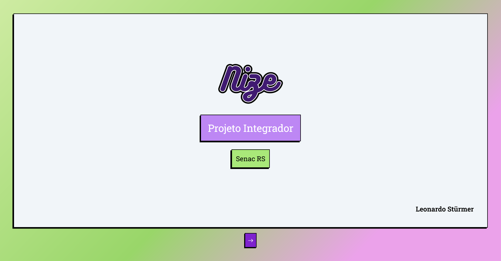
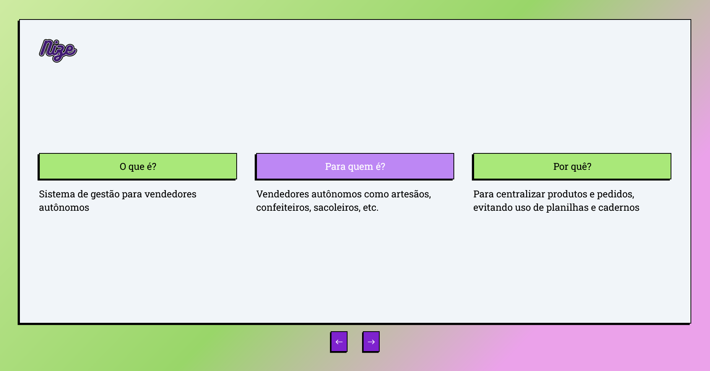
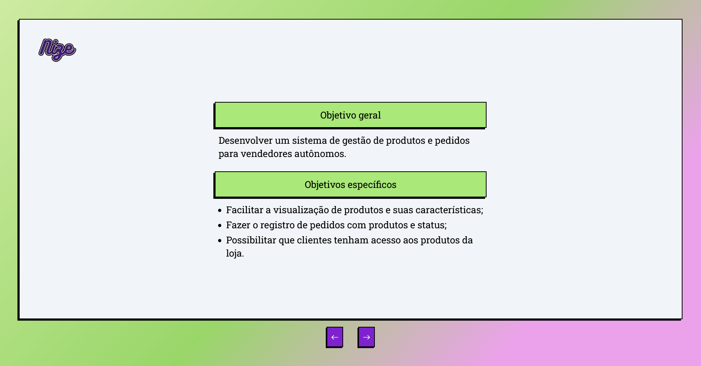
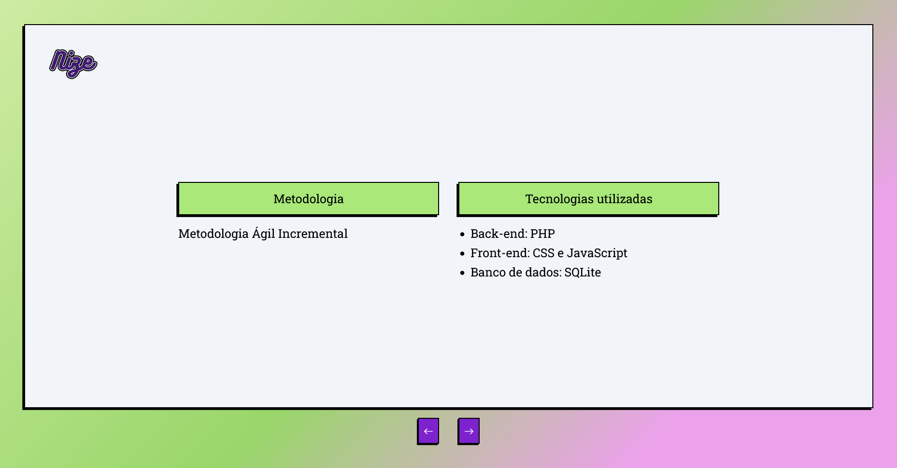
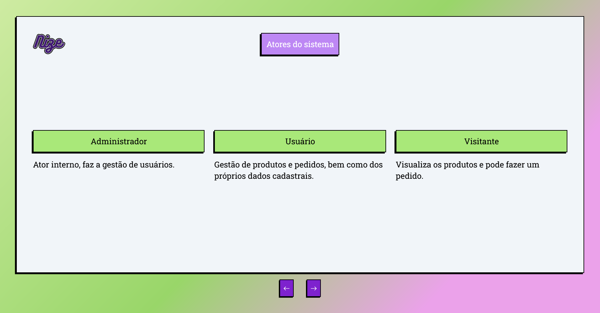
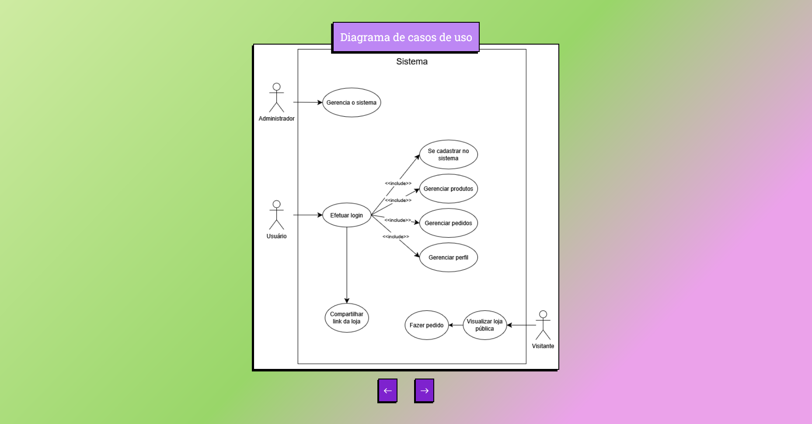
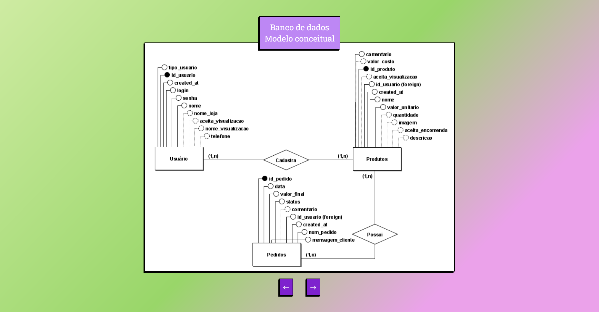
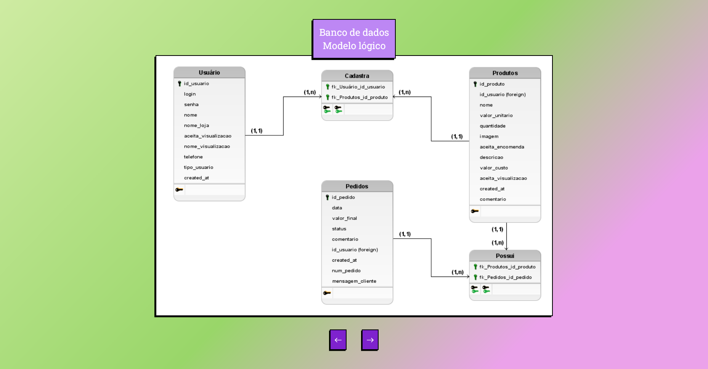
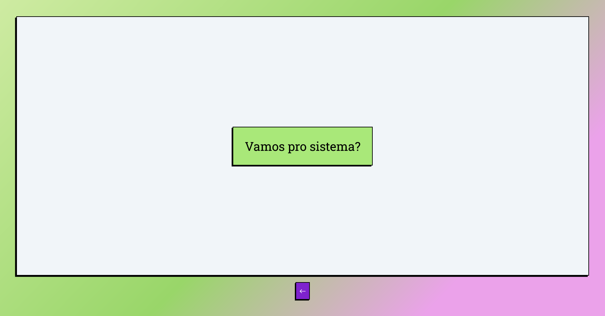

# Apresentação de Slide com HTML e Tailwind CSS

Este projeto é uma apresentação interativa e responsiva para praticar o uso de **Tailwind CSS**.

---

## Sobre o Projeto

O objetivo deste projeto foi explorar o framework **Tailwind CSS** na prática, construindo uma interface web aseada em uma apresentação de slides. 

A linguagem visual do projeto foi inspirada no [Nize](https://github.com/leosturmer/nize_web), mantendo a identidade visual do sistema.

---

## Processo de Desenvolvimento

1. **Prototipagem:** Inicialmente, os slides foram desenhados no Canva para definir a hierarquia visual e estética.
2. **Estruturação HTML e Tailwind:** O layout foi codificado focando no fundo, no quadro principal de conteúdo e nos componentes visuais com o auxílio da [documentação oficial do Tailwind](https://tailwindcss.com/).
3. **Ajustes e Responsividade (Uso de IA):** Para resolver problemas de alinhamento e adaptabilidade em diferentes tamanhos de tela, utilizei Inteligência Artificial como assistente. A IA auxiliou na reestruturação de propriedades `flexbox` e no ajuste de breakpoints responsivos.

---

## Telas da apresentação

| | | |
| :--- | :--- | :--- |
|  |  |   |
|  |  |   |
|  |  |   |

### Mockup Inicial (Canva)

Confira o [mockup inicial do projeto](assets/github/mockup_apresentacao.pdf).

---

## Sobre o Projeto Origem: Nize

O **Nize** é um sistema desenvolvido no curso de *Desenvolvimento de Sistemas do Senac*. Sua finalidade é facilitar a gestão de produtos e pedidos para vendedores autônomos, oferecendo também uma loja virtual para os clientes.

[Clique aqui para conhecer o repositório do Nize](https://github.com/leosturmer/nize_web)

---

## Tecnologias Utilizadas

- **HTML5**
- **Tailwind CSS**
- **Canva** (Prototipagem)